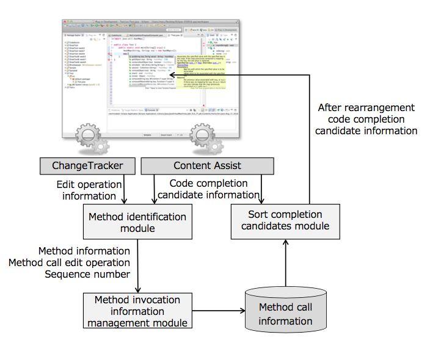
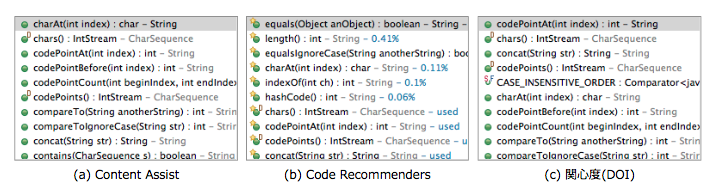

# ContentAssist
A code assist plugin for Eclipse.

In recent integrated development environments, by utilizing collective intelligence obtained from a large amount of source code described in the past, the method with higher possibility to be used in the source code is preferentially recommended. The method based on the statistical data is suitable for code complementation tailored to the tendency of the developer as a whole, but it is not always possible to provide an appropriate complementary candidate for a specific development team or individual developer. In this project, we propose a method to calculate the degree of interest of developers by utilizing the editing history that the developer written in the past, and rearrange the order of code completion candidates that can be displayed based on it.

## Requirement
JDK 1.7 or later

Eclipse 4.6 (Neon) or late (Eclipse for committer)

## Installation

1. Please run `git clone git@github.com:liaoziyang/ContentAssist.git` to copy the files to local.
2. Import this project to your workspace.

## System structure

## Compare to other content assist plugin

## Publication
Liao Ziyang， 丸山勝久， ["編集履歴から算出した開発者の関心度に基づくコード補完"](編集履歴から算出した開発者の関心度に基づくコード補完.pdf)， 日本ソフトウェア科学会第33回大会，FOSE2-3, 2016
